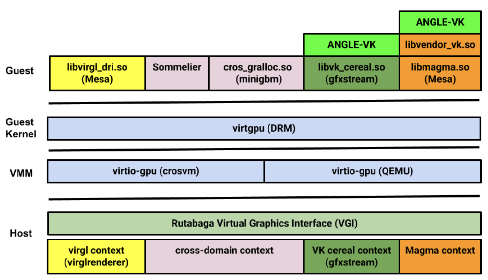

# Project Overview
## Purpose 
The purpose of this project is to be able to run the Vulkan test suite on a Google Pixel Fold running Alpine Linux, using a VGPU. 

## Application 
The application of this project is for an effort to repurpose Google Pixel Folds for compute. The future goal is to eventually be able to queue graphics API calls to a cluster of repurposed Pixels. This project's goal is to access the Pixel GPU in a server-client type interaction. 

## Background 
A VGPU system is necessary as the Pixel Fold does runs Bionic libc rather than GNU libc. A VGPU system allows a user to queue GPU commands from one device to another when the devices have different libc versions.  The tools that make up the VGPU interface are GFXstream and Rutabaga. 

GFXstream is a the engine which helps to forward graphics API calls between the host and guest device.
Rutabaga is the full abstraction layer which handles the dispatching of the GPU API calls and the display visualization. Below is the diagram of Rutabaga.



## Project MVP 
The MVP of our project is to display the interaction between the host and guest gfxstream applications. In our case Kumquat Media server is the host application and any vulkan command can be the guest application. 

# Android Background 

## Note 
This section goes over how to build the applications in this repo on Android; the executables and object files are already created in this repo. If you are just interested in using this tool on PMOS build please skip to the PMOS Pixel Fold build section below. 

## Termux, Android, Alpine Linux and more 
While our current Pixel Build runs Alpine Linux currently the executables for Rutabaga, libaemu, and gfxstream need to be built in Android OS to link properly against Bionic. The reason for this is that the some of the libraries required are not available in Alpine Linux so the executables fail to build. The workaround is to compile on Android OS, pull the executables to the Linux build, and copy the necessary shared object files into the PMOS library directories. 

## Setting up Termux on Android OS  
1. Disable built-in Linux on Android
    1. Go to Settings -> System -> Developer Options -> Linux development environment
    2. Move the switch to the off position
2. Navigate to this [website](https://f-droid.org/en/) 
3. Click on `Download F-Droid` button
4. Go to the Download and enable installation of apk from Chrome
5. open F-Droid and search for Termux
6. Install Termux
    1. When warned that Termux is meant for an older version of Android, press `more information` then `Install anyway`
7. Start Termux and in notifications press `Acquire wakelock`
8. Now run the following commands in termux `pkg update; pkg upgrade; pkg install tur-repo; pkg install code-server`
9. To launch code server run: `code-server --auth none --bind-addr 0.0.0.0:8080`
10. You can now navigate to `https://<device IPv4 addr>:8080` to view the VScode instance and terminal of the phone

## Building the Executables on Android
All four executables to be built from scratch must be built on Android. The builds which are made on Android will work on PMOS if the lib and include files are copied properly (See Necessary Linux Dependencies). The necessary lib and include files have been copied to this repo so the executables may be run on the PMOS build. To build Rutabaga and kumquat media server please refer to this [website](https://crosvm.dev/book/appendix/rutabaga_gfx.html) for each step except for the gfxstream guest section. For this section add the flags `--libdir /data/data/com.termux/files/usr/lib --includedir /data/data/com.termux/files/usr/include` to the command `meson setup guest-build/ -Dvulkan-drivers="gfxstream" -Dgallium-drivers="" -Dopengl=false`. Once all necessary files are copied onto PMOS, the kumquat executable will run; the client build may need to be rebuilt on the PMOS build (shown in below section)


# PMOS Pixel Fold build: Setting up your environment and running the VGPU in an Ubuntu Container

## Setting up your environment on the Alpine Linux Build
1. If this is the first time booting the phone you will need to flash the phone. You can find instructions on this in the Vulkan support google drive. 
2. To connect to the phone you can either communicate via Serial or by plugging the phone into the router and ssh'ing in. For MacOS users the router is the only option. Windows users may change their Internet Sharing IP subnet to 172.16.42.1-255 to enable internet sharing with the Linux build 
3. After ssh'ing into the Linux phone, you will need to partition a large enough drive to hold the repo (~300 MB). To create a new partition: 
    1. `sudo mkdir /<name of dir where you want to make your mount>`
    2. `sudo mkfs.ext4 /dev/sdaX` where X can be any integer between 1 and 31 as long as nothing is mounted on that sda, you can check this by running `mount`
    3. `sudo mount -t auto /dev/sdaX /<same dir you just made>`
    4. Now make a directory in `~` and run `sudo mount -t auto /dev/sdaX ~/<new dir>`
    5. This new directory will be where you work going forward, run `chmod 777 <new dir>` to make it rw+ permissions
    6. Now cd into your new directory in the home directory and run  `sudo mkdir containerd`, then `sudo vi /etc/containerd/config.toml`
    7. Change the root variable to point to `/home/user/<name>/containerd` then :wq  the file to save and close it
    8. Then run `sudo rc-service containerd restart`
4. You now need to remove iptables and add back iptables using `sudo apk del iptables` followed by `sudo apk add iptables` and then `sudo apk add git`
5. You can now configure a ssh key and link it to your github account
6. Now clone our repo and install the necessary dependencies
   
## Necessary Linux Dependencies and commands to run before executing
Run `sudo nerdctl images` then run `sudo nerdctl rmi <image>` for the second image.
```
sudo rm -rf /home/google3/
sudo rm -rf /usr/local/google/
sudo chmod 777 /tmp/
sudo apk add rust
sudo apk add cargo
cd JunkyardVGPU
sudo cp -r postmarketOS/* /
sudo apk add vulkan-tools
sudo apk add vulkan-loader
sudo apk add meson
sudo apk add py3-mako
sudo apk add py3-yaml
sudo apk add py3-packaging
sudo apk add cmake
sudo apk add libdrm-dev
sudo apk add byacc
sudo apk add flex
sudo apk add wayland-dev
sudo apk add libxcb-dev
sudo apk add libx11-dev
sudo apk add libxshmfence-dev
sudo apk add libxrandr-dev
sudo apk add g++
export CC=/usr/bin/gcc
export CXX=/usr/bin/g++

```

## Running the Kumquat Media Server and Client interface on PMOS
1. After installing the dependencies above you should be able to run the server and client interface without much modification!
2. Consider using a tool such as tmux to have two terminals open at the same time or just open two separate ssh windows -- one will be the server terminal and one will be the client
3. In the server window `cd crosvm/rutabaga_gfx/kumquat/server` then `sudo ./target/debug/kumquat` and you should see the server instance start.
4. Switch to your other terminal and we need to set the below env variables to start the guest interface: 
   ```
   export MESA_LOADER_DRIVER_OVERRIDE=zink
    export VIRTGPU_KUMQUAT=1
    export VK_ICD_FILENAMES=/home/user/<name of your directory>/JunkyardVGPU/mesa/guest-build/src/gfxstream/guest/vulkan/gfxstream_vk_devenv_icd.aarch64.json 
   ```
5. You may have to edit the libary path section of /home/user/<name of your directory>/JunkyardVGPU/mesa/guest-build/src/gfxstream/guest/vulkan/gfxstream_vk_devenv_icd.aarch64.json to point to your version of libvulkan_gfxstream.so. This object is stored in `/home/user/<directory>/JunkYardVGPU/mesa/guest-build/src/gfxstream/guest/vulkan/libvulkan_gfxstream.so`
6. When you run `sudo /usr/bin/vulkaninfo` in the guest terminal, you should see the vulkan object created and destroyed in the server window and the output of vulkaninfo displayed in the guest terminal.
7. You should see output similar to this in your server window: 
5. To test, run `sudo /usr/bin/vulkaninfo` and you should see the result from vulkan-info displayed on the terminal you typed in and these lines on the screen running kumquat server: 
    ```
    I0519 00:14:09.898348   27089 VkDecoderGlobalState.cpp:972] Created VkInstance:0xb400007e5eadc410 for application:vulkaninfo engine:.                                                                  
    I0519 00:14:09.932460   27089 VkDecoderGlobalState.cpp:2039] Created VkDevice:0xb400007f0eb07580 for application:vulkaninfo engine: ASTC emulation:off CPU decoding:off.                                
    I0519 00:14:09.962327   27089 VkDecoderGlobalState.cpp:2286] Destroyed VkDevice:0xb400007f0eb07580 
    I0519 00:14:09.962595   27089 VkDecoderGlobalState.cpp:8683] Destroyed VkInstance:0xb400007e5eadc410 for application:vulkaninfo engine:.
    ```
8. Now you have the client successfully running! please leave your environment as is and proceed to Setting up the Ubuntu Container. 

## Setting up the Ubuntu Container
1. Navigate to your new mounted directory inside your home directory; this set of instructions assumes that you've already done the previous section. Leave the server window as is, all of this can be done in the guest terminal. 
2. run `sudo nerdctl pull ajayrr/opencl-kube:arm64`, this will download and unpack an Ubuntu container image.
3. run `sudo nerdctl images` and find the opencl-kube:arm64 image, then run `sudo nerdctl run -v /tmp:/tmp -it <image id>`; this will start the container; for now type `exit`
4. run `sudo nerdctl ps -a` to see all nerdctl processes, copy the container ID from this output, then run `sudo nerdctl start <container id>`
5. run ` sudo nerdctl exec --user root -it <container id> /bin/bash`; this will log in as root to the container, you will notice that instead of google-felix-1 you will now see root@<container_id> as your device name in the commandline
6. run `ls` and ensure you are in `~`, then run `rm -rf *` to delete all files in the container home directory, then git clone the JunkyardVGPU repo in the container
7. `cd JunkyardVGPU` and `cp -r Ubuntu/* /`; this will copy all of the necessary home directory shared object files. 
8. Now run `apt update` then `apt upgrade` and `apt autoremove mesa-vulkan-drivers` then `apt install vulkantools`
9. Now set the following environment variables: 
    ```
    export MESA_LOADER_DRIVER_OVERRIDE=zink
    export VIRTGPU_KUMQUAT=1
    export VK_ICD_FILENAMES=/home/ubuntu/JunkYardVGPU/mesa/guest-build/src/gfxstream/guest/vulkan/gfxstream_vk_icd.aarch64.json  
   ```
10. Now you can run `vulkaninfo` in the guest terminal and shoud see similar results as you did in the previous section. 


# Resources, Repositories, and External Tools used in this Repo

AEMU:           https://android.googlesource.com/platform/hardware/google/aemu
GFXStream:      https://android.googlesource.com/platform/hardware/google/gfxstream
Mesa:           https://gitlab.freedesktop.org/mesa/mesa.git 


